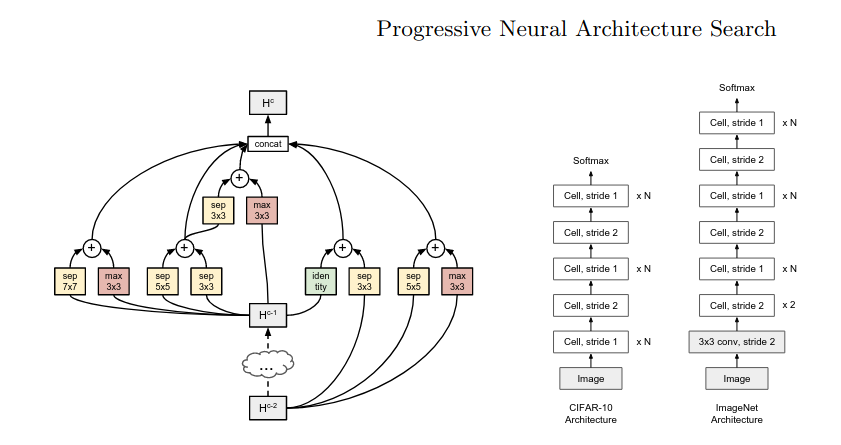

# progressive-neural-architecture-search-torch
Unofficial PyTorch implementation of Progressive Neural Architecture Search. https://arxiv.org/pdf/1712.00559.pdf




## ToDo
- [ ] Add Unittests
- [ ] Push PyPi
- [ ] Better and easier data cleaning
- [ ] Better README
- [ ] Add requirements.txt

## USAGE
1. Download and clean animal-10 Dataset with SEE: [clean_data.py](utils/clean_data.py)

2. SEE: [train.py](train.py)

```python
import torch
from src.pnasnet import PNASNet

model = PNASNET(num_classes=5).to(device)

train_img_folder = torchvision.datasets.ImageFolder(dataset_path, transform=transform)
train_loader = torch.utils.data.DataLoader(train_img_folder, batch_size=4, shuffle=True, num_workers=1, pin_memory=True)

lr = 1e-5
optimizer = torch.optim.Adam(model.parameters(), lr=lr)

loss_fn = nn.NLLLoss().to(device)

model.train()
for epoch in range(2):
    train_one_epoch(model, optimizer, train_loader, loss_fn)
```
## Citations
**Paper:**
```bibtex
@misc{liuprogressive,
  title={Progressive Neural Architecture Search},
  author={Liu, Chenxi and Zoph, Barret and Neumann, Maxim and Shlens, Jonathon and Hua, Wei and Li, Li-Jia and Fei-Fei, Li and Yuille, Alan and Huang, Jonathan and Murphy, Kevin},,
  note={arXiv preprint arXiv:1712.00559},
  howpublished={\url{https://arxiv.org/pdf/1712.00559.pdf}},
}
```
**Dataset:**
Animal-10 on [kaggle](https://www.kaggle.com/datasets/alessiocorrado99/animals10)
